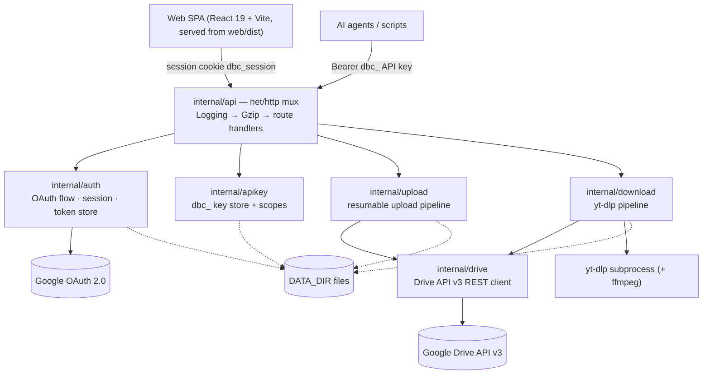

# Architecture Overview — Drive Backup Console

Self-hosted, single-user Google Drive web console. One Go binary serves both the REST API and the built React SPA; configuration/state live on local disk under `DATA_DIR`, file bytes live in Google Drive.

> Verified against source on 2026-09-05 (main @ `992a990`). Dependency edges below come from `go list`, not from memory.

## 1. System panorama



## 2. Module map & dependency boundaries

Actual internal import graph (leaf → top):

```
config   (no internal deps)
drive    (no internal deps)          apikey  (no internal deps)
auth     → config
upload   → drive
download → drive
api      → auth, apikey, upload, download, drive, config
cmd/server → api, auth, apikey, config, download, upload
```

Responsibilities per package:

- **`cmd/server`** — composition root, nothing else: load `.env` → `config.Load` → build pooled HTTP transport (optional `HTTP_PROXY`) → construct auth/upload/apikey/download services → wire `api.Deps` → install Logging → Gzip middleware → graceful shutdown with store flush.
- **`internal/config`** — env parsing + defaults, fail-fast on missing required vars (unless `DEV_MODE=1`).
- **`internal/drive`** — the **only** package that talks to Google's Drive API v3 (raw REST + `golang.org/x/oauth2`, no Google SDK). One file per operation (list/search/content/upload/share/revisions/zip…), plus retry/transport wrappers.
- **`internal/auth`** — OAuth 2.0 code flow with CSRF state, token persistence (`DATA_DIR/token.json`), HMAC-signed session cookie `dbc_session`. Also builds a per-request `*drive.Client` from the stored token (exposed to handlers via `DriveFactory`).
- **`internal/apikey`** — `dbc_`-prefixed API keys persisted to `DATA_DIR/apikeys.json`; scopes `read` / `readwrite`; tokens shown once at creation.
- **`internal/upload`** — resumable-upload state machine. Depends on the `DriveUploader` **interface** (not the concrete client), so it can be unit-tested with a fake. Jobs persisted to `DATA_DIR/uploads.json` (debounced writes + `SaveNow` on shutdown), reaper cleans terminal jobs (10 min tick, 1 h max age).
- **`internal/download`** — yt-dlp pipeline: metadata (`--simulate`) → download to `DOWNLOAD_TMP_DIR` → resumable upload to Drive. Depends on `drive` for the upload phase. Jobs persisted to `DATA_DIR/downloads.json`; per-domain proxy routing (domestic sites bypass `DOWNLOAD_PROXY`); feature disabled entirely when `YTDLP_PATH` is unset.
- **`internal/api`** — HTTP boundary only: `router.go` (Go 1.22+ method patterns), auth/scope middleware, body limits, gzip, logging, static SPA serving, OpenAPI doc. Handlers receive a per-request Drive client via `DriveFactory`; they hold no Google tokens themselves.
- **`web/`** — React 19 + TypeScript + Vite 6 SPA. `src/lib` holds the API client and **external stores** (`fileStore`, `uploadSession`, `downloadStore`) consumed via `useSyncExternalStore`; `src/components` holds pages and UI. The SPA never talks to Google — everything proxies through the Go server.

Boundary rules (breaking one is a bug, not a refactor):

1. Only `internal/drive` performs Google REST calls.
2. Handlers never persist state directly — they go through the upload/download/apikey stores.
3. `upload`/`download` must not import `api`; service packages never depend on HTTP concerns.
4. `/api/v1/*` reuses the **same handlers** as `/api/*` with scope guards — any behavior change must keep both namespaces and `docs/api-contract.md` + `internal/api/openapi.json` in sync.
5. `drive` and `config` are leaves; if they need something from a sibling, invert it.

## 3. Core data flows

- **Login**: browser → `GET /oauth2/login` → Google consent → `/oauth2/callback` validates CSRF state, exchanges code, stores token at `DATA_DIR/token.json`, sets signed `dbc_session` cookie → redirect to `FRONTEND_ORIGIN`.
- **Resumable upload**: `POST /api/uploads` opens a Drive resumable session → `PUT /api/uploads/{id}/chunk` (≤32 MiB, offset must equal server `bytesReceived`, mismatch → 409 + current offset so the client resumes) → adaptive flush to Drive in 256 KiB multiples (16 MiB default, 32 MiB for files >200 MB, pipelined with incoming chunks) → `status: completed` + `fileId`.
- **File download**: `GET /api/files/{id}/download` streams with `Range` passthrough — powers video/PDF seeking and the SPA's parallel downloads.
- **Media download (yt-dlp)**: `POST /api/downloads` → two-phase job: download to temp dir, then upload to Drive (target folder auto-created if a name is given). Upload failure ≠ re-download: `POST /api/downloads/{id}/retry-upload` reuses the local temp file. Direct links whose extension yt-dlp reports as `unknown_video` get the extension inferred from the URL.
- **Agent access**: `Authorization: Bearer dbc_…` → `guardScope(read|readwrite)` → same handler as the UI route.

## 4. Conventions that span packages

- Error envelope everywhere: `{"error": {"code", "message"}}`; statuses `400` validation, `401` auth, `403` scope/permission, `404`, `429` Google quota, `502` upstream.
- Body limits live in `router.go`: JSON mutations 64 KiB–3 MiB, batch 1 MiB, chunk 32 MiB, simple upload 5 MiB.
- Durability: all long-running job state (uploads, downloads, keys, token) is a JSON file under `DATA_DIR` — survives restarts by design; reapers only delete **terminal** jobs older than 1 h.
- Single-user security model (see `docs/design.md`): one Google account, one stored token, full `auth/drive` scope; session secret required in production, ephemeral in `DEV_MODE`.

## 5. External dependencies & integration points

- Google Drive API v3 + Google OAuth 2.0 (raw REST, `golang.org/x/oauth2` is the only runtime Go dependency).
- yt-dlp + ffmpeg subprocesses (Docker image ships both; local dev installs them separately).
- `HTTP_PROXY` applies to Google API calls; `DOWNLOAD_PROXY` applies only to yt-dlp, and only for sites that need it.

## 6. Tech debt & known trade-offs

Carried over from the 2026-07-27 audit (see `docs/archive/2026-07-27-ARCHITECTURE_RECOMMENDATIONS.md` for full context):

- `api` handlers depend on the concrete `*drive.Client` through `DriveFactory`; `upload` already uses an interface (`DriveUploader`). Introducing a `drive.Backend` interface would let API tests drop the `httptest` Google-protocol fakes.
- `FilesHandlers` spans 2 files / 21 methods over CRUD, streaming, sharing, and batch concerns — a split is recommended if it keeps growing.
- No automated browser E2E; releases rely on unit tests + manual smoke.
- Docker final image ~80 MB (Alpine + yt-dlp + ffmpeg) vs ~12 MB distroless before — deliberate trade-off for out-of-the-box downloads.
