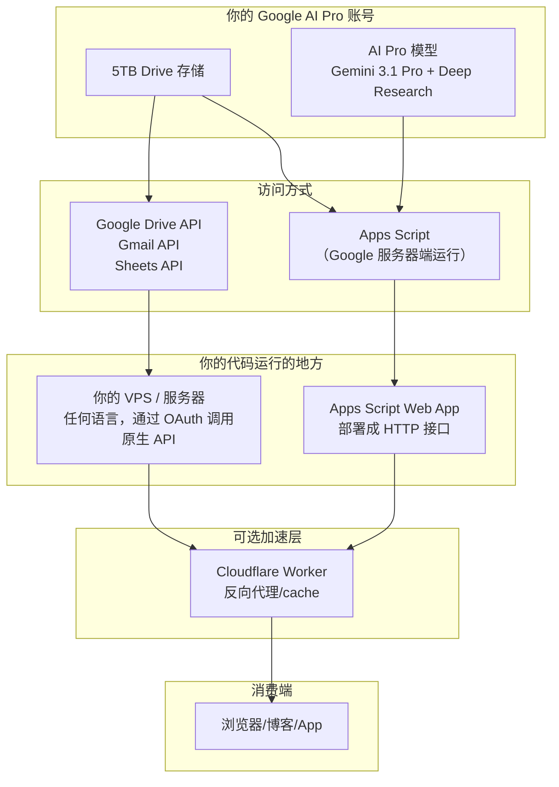
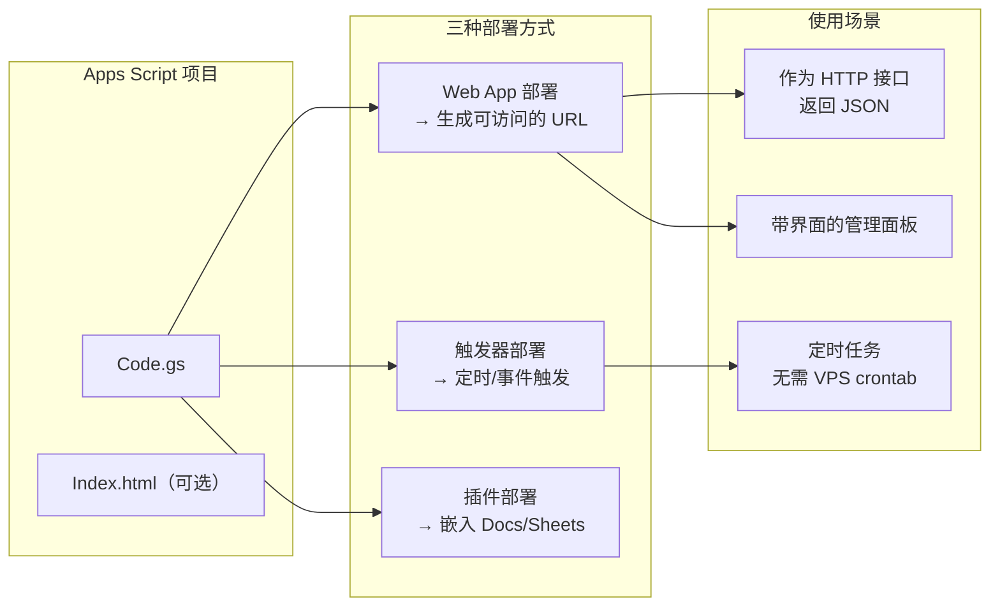
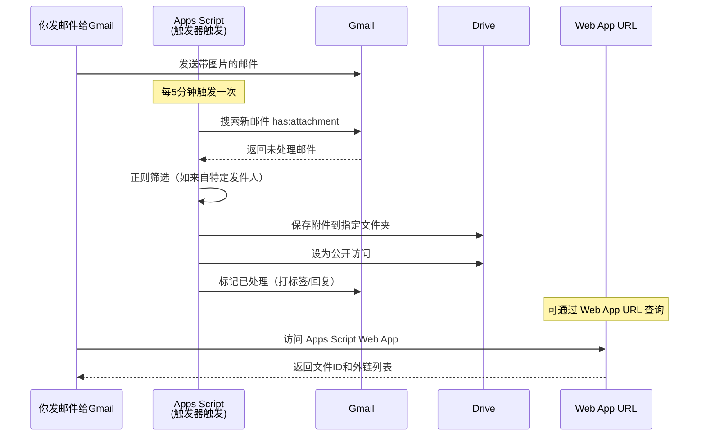
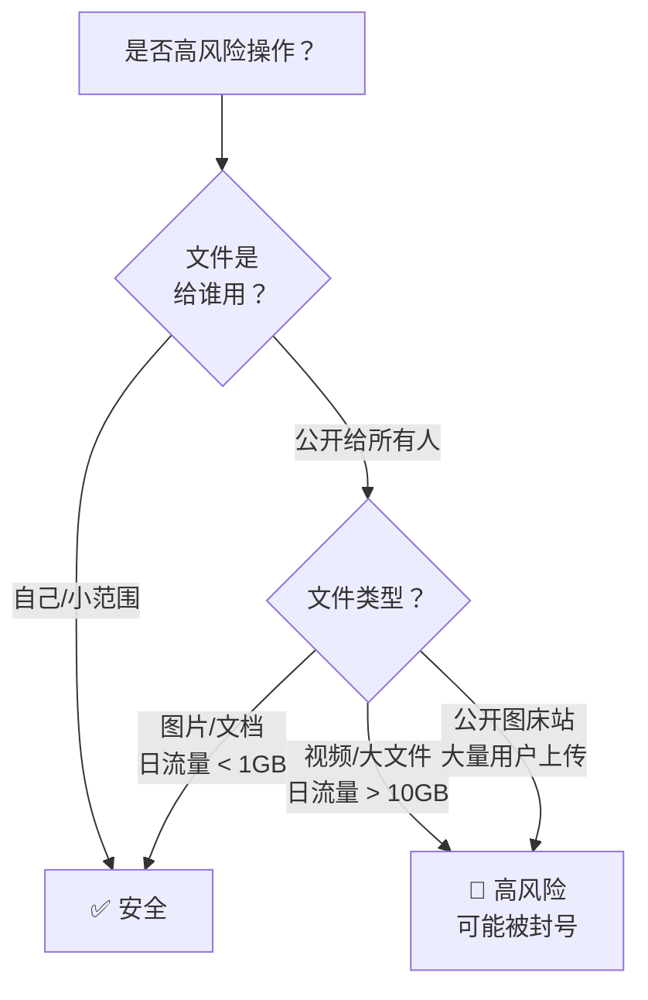

# Google AI Pro 开发者实用指南

> 适用场景：你已有 Google AI Pro 会员（$19.99/月），拥有 5TB Drive 存储，
> 不想绑定信用卡开通 GCP 计费，希望以开发者身份通过 API 程序化使用这些服务。
> 最后更新：2026-07

---

## 目录

1. [全景架构：你的 Google 资源怎么组合](#1-全景架构你的-google-资源怎么组合)
2. [准备工作：创建 OAuth 凭据（零成本，不绑卡）](#2-准备工作创建-oauth-凭据零成本不绑卡)
3. [Google Drive API：把你的 5TB 变成可编程文件系统](#3-google-drive-api把你的-5tb-变成可编程文件系统)
4. [Google Apps Script：不需要服务器的自动化中枢](#4-google-apps-script不需要服务器的自动化中枢)
5. [Gmail API：邮件自动化（原生 API + Apps Script 两种方式）](#5-gmail-api邮件自动化原生-api--apps-script-两种方式)
6. [组合实战1：邮件附件自动提取 → Drive 图床](#6-组合实战1邮件附件自动提取--drive-图床)
7. [组合实战2：用 Drive 做文件床 + CF 中转加速](#7-组合实战2用-drive-做文件床--cf-中转加速)
8. [组合实战3：Apps Script 作为你的 API 网关](#8-组合实战3apps-script-作为你的-api-网关)
9. [配额、限制与风险控制](#9-配额限制与风险控制)
10. [常见问题](#10-常见问题)

---

## 1. 全景架构：你的 Google 资源怎么组合



**关键概念：**

- **Google Drive API（原生 REST）**：从你自己的服务器/VPS 直接调用，上传/下载/管理文件
- **Apps Script（内置 API 封装）**：在 Google 服务器上运行，不需要你自己的服务器，自动处理好认证
- **两者底层是同一套存储**：操作的都是你的 5TB Drive

---

## 2. 准备工作：创建 OAuth 凭据（零成本，不绑卡）

### 2.1 创建 Google Cloud 项目（不需要开通计费）

1. 打开 https://console.cloud.google.com
2. 点击顶部项目下拉菜单 → **新建项目**
3. 输入项目名称（如 `ai-pro-dev`）
4. 点击**创建**
5. **不需要转到"计费"去绑定信用卡**

> ⚠️ 这一步你只需要有 Google 账号即可。Google Cloud 项目的创建不要求绑卡。
> 只有在使用需要计费的服务（如 Cloud Storage、Compute Engine）时才需要。
> 我们只用免费配额内的 Drive API 和 Apps Script——**完全不需要绑卡。**

### 2.2 启用 Drive API

1. 在项目中，左侧菜单 → **API 和服务** → **库**
2. 搜索 `Google Drive API`
3. 点击**启用**

### 2.3 创建 OAuth 2.0 凭据

1. 左侧菜单 → **API 和服务** → **凭据**
2. 点击 **+ 创建凭据** → **OAuth 客户端 ID**
3. 应用类型：选择 **桌面应用**（或 Web 应用，取决于你的使用方式）
4. 名称：`dev-client`
5. 点击**创建**
6. 弹出窗口中点击**下载 JSON**（保存为 `credentials.json`）

> 💡 如果你要在 Web 应用中使用，选"Web 应用"，在"已授权的 JavaScript 来源"中添加你的域名（或 `http://localhost` 用于本地测试）。

### 2.4（可选）启用更多 API

| API | 用途 | 启用方式 |
|-----|------|---------|
| Gmail API | 程序化读/写邮件 | 同样在 API 库搜索 `Gmail API` 启用 |
| Google Sheets API | 把表格当数据库用 | 搜索 `Google Sheets API` 启用 |
| Google Calendar API | 日历自动化 | 搜索 `Google Calendar API` 启用 |

---

## 3. Google Drive API：把你的 5TB 变成可编程文件系统

### 3.1 安装客户端库

**Python：**
```bash
pip install --upgrade google-api-python-client google-auth-httplib2 google-auth-oauthlib
```

**Node.js：**
```bash
npm install googleapis @google-cloud/local-auth
```

### 3.2 快速上手：Python 示例

创建一个 Python 脚本 `drive_quickstart.py`：

```python
import os
import pickle
from google.auth.transport.requests import Request
from google.oauth2.credentials import Credentials
from google_auth_oauthlib.flow import InstalledAppFlow
from googleapiclient.discovery import build
from googleapiclient.http import MediaFileUpload, MediaIoBaseDownload
import io

# 如果修改了 scope，需要删除 token.pickle 重新认证
SCOPES = ['https://www.googleapis.com/auth/drive']

def get_credentials():
    """获取/刷新 OAuth 凭据"""
    creds = None
    if os.path.exists('token.pickle'):
        with open('token.pickle', 'rb') as token:
            creds = pickle.load(token)
    if not creds or not creds.valid:
        if creds and creds.expired and creds.refresh_token:
            creds.refresh(Request())
        else:
            flow = InstalledAppFlow.from_client_secrets_file('credentials.json', SCOPES)
            creds = flow.run_local_server(port=0)
        with open('token.pickle', 'wb') as token:
            pickle.dump(creds, token)
    return creds

def list_files():
    """列出最新的 10 个文件"""
    creds = get_credentials()
    service = build('drive', 'v3', credentials=creds)
    results = service.files().list(
        pageSize=10,
        fields="nextPageToken, files(id, name, mimeType, size, createdTime)"
    ).execute()
    return results.get('files', [])

def upload_file(local_path, mime_type=None):
    """上传文件到 Drive 根目录"""
    creds = get_credentials()
    service = build('drive', 'v3', credentials=creds)
    file_name = os.path.basename(local_path)
    file_metadata = {'name': file_name}
    media = MediaFileUpload(local_path, mimetype=mime_type, resumable=True)
    file = service.files().create(body=file_metadata, media_body=media, fields='id').execute()
    return file.get('id')

def download_file(file_id, save_path):
    """下载文件到本地"""
    creds = get_credentials()
    service = build('drive', 'v3', credentials=creds)
    request = service.files().get_media(fileId=file_id)
    fh = io.BytesIO()
    downloader = MediaIoBaseDownload(fh, request)
    done = False
    while not done:
        status, done = downloader.next_chunk()
        print(f"下载进度: {int(status.progress() * 100)}%")
    with open(save_path, 'wb') as f:
        f.write(fh.getvalue())

def set_public_permission(file_id):
    """设置文件为公开可访问（Anyone with link can view）"""
    creds = get_credentials()
    service = build('drive', 'v3', credentials=creds)
    permission = {
        'type': 'anyone',
        'role': 'reader',
    }
    service.permissions().create(fileId=file_id, body=permission).execute()
    print(f"文件 {file_id} 已设为公开")

def make_public_url(file_id):
    """生成可直接嵌入的公开链接"""
    # 图片/文件直链（lh3 端点，非官方但稳定）
    return f"https://lh3.googleusercontent.com/d/{file_id}"
    # 备用（官方下载链接）
    # return f"https://drive.google.com/uc?export=view&id={file_id}"

# ===== 使用示例 =====
if __name__ == '__main__':
    # 列出文件
    files = list_files()
    for f in files:
        print(f"{f['name']} ({f['id']})")

    # 上传文件
    file_id = upload_file('screenshot.png', 'image/png')

    # 设为公开
    set_public_permission(file_id)

    # 获取可嵌入链接
    url = make_public_url(file_id)
    print(f"公开链接: {url}")
```

### 3.3 运行

```bash
python drive_quickstart.py
```

首次运行会打开浏览器，让你登录 Google 账号授权。授权后，`token.pickle` 会保存凭据，下次无需重复授权。

**认证一次，之后脚本可以无人值守跑。**

### 3.4 常用 API 速查

```python
# 创建文件夹
folder = service.files().create(body={
    'name': '我的备份',
    'mimeType': 'application/vnd.google-apps.folder'
}, fields='id').execute()

# 上传到指定文件夹
file = service.files().create(body={
    'name': 'backup.tar.gz',
    'parents': ['FOLDER_ID']
}, media_body=MediaFileUpload('backup.tar.gz')).execute()

# 搜索文件
results = service.files().list(
    q="name contains 'backup' and trashed=false",
    fields="files(id, name, createdTime)"
).execute()

# 删除文件（进回收站）
service.files().update(fileId=FILE_ID, body={'trashed': True}).execute()

# 获取文件下载链接
service.files().get(fileId=FILE_ID, fields='webContentLink').execute()

# 分享给特定邮箱
service.permissions().create(fileId=FILE_ID, body={
    'type': 'user',
    'role': 'reader',
    'emailAddress': 'user@example.com'
}).execute()
```

---

## 4. Google Apps Script：不需要服务器的自动化中枢

### 4.1 入口

打开 https://script.google.com → **新建项目**

### 4.2 三种部署模式



### 4.3 Web App 基础模板（返回 JSON）

```javascript
// Code.gs
function doGet(e) {
  var action = e.parameter.action || 'ping';

  switch(action) {
    case 'ping':
      return jsonResponse({ status: 'ok', time: new Date().toISOString() });

    case 'listFiles':
      var folderId = e.parameter.folderId || 'root';
      var files = listDriveFiles(folderId);
      return jsonResponse({ files: files });

    case 'searchEmails':
      var query = e.parameter.q || 'from:notification';
      var emails = searchGmail(query);
      return jsonResponse({ emails: emails });

    default:
      return jsonResponse({ error: 'unknown action' });
  }
}

function doPost(e) {
  var data = JSON.parse(e.postData.contents);
  // 处理 POST 请求
  return jsonResponse({ received: data });
}

function jsonResponse(data) {
  return ContentService
    .createTextOutput(JSON.stringify(data))
    .setMimeType(ContentService.MimeType.JSON);
}

function listDriveFiles(folderId) {
  var folder = folderId === 'root'
    ? DriveApp.getRootFolder()
    : DriveApp.getFolderById(folderId);
  var files = folder.getFiles();
  var result = [];
  while (files.hasNext()) {
    var f = files.next();
    result.push({
      name: f.getName(),
      id: f.getId(),
      size: f.getSize(),
      url: f.getUrl(),
      type: f.getMimeType()
    });
  }
  return result;
}

function searchGmail(query) {
  var threads = GmailApp.search(query, 0, 20);
  return threads.map(function(thread) {
    return {
      subject: thread.getFirstMessageSubject(),
      date: thread.getLastMessageDate().toISOString(),
      messageCount: thread.getMessageCount(),
      id: thread.getId()
    };
  });
}
```

### 4.4 部署为 Web App

1. 在 Apps Script 编辑器中点击 **部署** → **新建部署**
2. 类型选择 **Web 应用**
3. 执行身份：选择 **"我"**（只有你能调用，需要登录）
4. 访问权限：选择 **"任何人"**（任何人都能访问，但需登录）
5. 点击 **部署** → 复制生成的 URL

> 💡 **关于访问权限：**
> - 选"我" → 只有你的 Google 账号能访问（会跳转登录）
> - 选"任何人" → 任何有 Google 账号的人都能访问
> - 不能设成"完全公开免登录"（Google 的安全策略）
>
> 但你可以在你的 VPS 上用 curl 带你的 OAuth token 来调用，完全不用打开浏览器。

### 4.5 用 curl 调用你的 Web App

```bash
# 先获取 access token（需要先设置好 OAuth）
ACCESS_TOKEN="你的token"

# 调用你的 Apps Script Web App
curl -H "Authorization: Bearer $ACCESS_TOKEN" \
  "https://script.google.com/macros/s/YOUR_DEPLOY_ID/exec?action=ping"

# 列出 Drive 文件
curl -H "Authorization: Bearer $ACCESS_TOKEN" \
  "https://script.google.com/macros/s/YOUR_DEPLOY_ID/exec?action=listFiles&folderId=root"

# 搜索邮件
curl -H "Authorization: Bearer $ACCESS_TOKEN" \
  "https://script.google.com/macros/s/YOUR_DEPLOY_ID/exec?action=searchEmails&q=from:noreply"
```

### 4.6 设置定时触发器

1. 在 Apps Script 编辑器中，左侧点击 **触发器**（⏰ 图标）
2. 点击 **+ 添加触发器**
3. 选择要运行的函数
4. 选择时间间隔（每分钟/每小时/每天/每周）

**示例：每天凌晨 2 点自动备份**

```javascript
// 这个函数可以设置每天早上 2:00 自动跑
function dailyBackupToDrive() {
  // 创建以日期命名的文件夹
  var today = Utilities.formatDate(new Date(), 'Asia/Shanghai', 'yyyy-MM-dd');
  var folder = DriveApp.createFolder('auto-backup-' + today);

  // 归档 Gmail 中昨天的附件
  var yesterday = new Date(Date.now() - 86400000);
  var dateStr = Utilities.formatDate(yesterday, Session.getScriptTimeZone(), 'yyyy/MM/dd');
  var threads = GmailApp.search('after:' + dateStr + ' has:attachment');

  threads.forEach(function(thread) {
    thread.getMessages().forEach(function(msg) {
      msg.getAttachments().forEach(function(att) {
        folder.createFile(att.copyBlob());
      });
    });
  });

  // 发通知给自己
  GmailApp.sendEmail(
    Session.getActiveUser().getEmail(),
    '每日备份完成',
    '已备份 ' + folder.getFiles().length + ' 个文件到 ' + folder.getName()
  );
}
```

### 4.7 UrlFetchApp：让 Apps Script 能请求外部服务

```javascript
function fetchExample() {
  // GET 请求
  var resp = UrlFetchApp.fetch('https://api.github.com/repos/google/zx');
  var data = JSON.parse(resp.getContentText());
  Logger.log('Stars: ' + data.stargazers_count);

  // POST JSON
  var options = {
    method: 'post',
    contentType: 'application/json',
    payload: JSON.stringify({ message: 'hello' }),
    headers: { 'Authorization': 'Bearer YOUR_TOKEN' },
    muteHttpExceptions: true  // 即使返回错误也不抛异常
  };
  var resp2 = UrlFetchApp.fetch('https://httpbin.org/post', options);
  Logger.log(resp2.getContentText());

  // POST 表单/文件
  var blob = Utilities.newBlob('Hello World', 'text/plain', 'test.txt');
  var formData = {
    name: 'test',
    file: blob
  };
  UrlFetchApp.fetch('https://example.com/upload', {
    method: 'post',
    payload: formData  // 自动 multipart/form-data
  });
}
```

**UrlFetchApp 的局限：**
- 超时：简单请求 6 分钟，可调
- URL 最大 2082 字符
- 总执行时间：Apps Script 单次执行最长 30 分钟（普通账号）或 6 分钟（consumer 账号）
- 源自 Google 的 IP 池，可能有速率限制

### 4.8 HTML Service：给你的 Web App 加界面（按需使用）

如果你需要用浏览器直接打开你的 Web App 并交互，可以在项目中添加 HTML 文件：

`Index.html`：
```html
<!DOCTYPE html>
<html>
<head>
  <base target="_top">
  <style>
    body { font-family: system-ui; max-width: 800px; margin: auto; padding: 20px; }
    input, button { padding: 8px 12px; margin: 4px; }
    #result { background: #f5f5f5; padding: 12px; border-radius: 4px; white-space: pre-wrap; }
  </style>
</head>
<body>
  <h1>Google 服务管理面板</h1>
  <input type="text" id="query" placeholder="搜索条件" />
  <button onclick="searchEmails()">搜索邮件</button>
  <button onclick="listFiles()">列出文件</button>
  <button onclick="uploadAttachment()">上传附件到 Drive</button>
  <div id="result"></div>

  <script>
    function showResult(data) {
      document.getElementById('result').textContent = JSON.stringify(data, null, 2);
    }

    function searchEmails() {
      var q = document.getElementById('query').value || 'in:inbox newer_than:1d';
      google.script.run
        .withSuccessHandler(showResult)
        .searchGmail(q);
    }

    function listFiles() {
      google.script.run
        .withSuccessHandler(showResult)
        .listDriveFiles('root');
    }

    function uploadAttachment() {
      var html = '<input type="file" id="fileInput" />' +
                 '<button onclick="upload()">上传</button>';
      var ui = HtmlService.createHtmlOutput(html)
        .setWidth(400)
        .setHeight(150);
      SpreadsheetApp.getUi().showModalDialog(ui, '选择文件');
    }
  </script>
</body>
</html>
```

对应的 `Code.gs`：
```javascript
function doGet() {
  return HtmlService.createHtmlOutputFromFile('Index')
    .setTitle('Google 管理面板');
}
```

---

## 5. Gmail API：邮件自动化（原生 API + Apps Script 两种方式）

### 5.1 方式一：原生 REST API（从你的 VPS 调用）

```python
# gmail_quickstart.py
from googleapiclient.discovery import build
from google_auth_oauthlib.flow import InstalledAppFlow
from google.auth.transport.requests import Request
import pickle, os, base64
from email.mime.text import MIMEText

SCOPES = ['https://www.googleapis.com/auth/gmail.modify']

def get_gmail_service():
    creds = None
    if os.path.exists('gmail_token.pickle'):
        with open('gmail_token.pickle', 'rb') as t:
            creds = pickle.load(t)
    if not creds or not creds.valid:
        if creds and creds.expired and creds.refresh_token:
            creds.refresh(Request())
        else:
            flow = InstalledAppFlow.from_client_secrets_file('credentials.json', SCOPES)
            creds = flow.run_local_server(port=0)
        with open('gmail_token.pickle', 'wb') as t:
            pickle.dump(creds, t)
    return build('gmail', 'v1', credentials=creds)

def search_messages(query='in:inbox'):
    """搜索邮件"""
    service = get_gmail_service()
    result = service.users().messages().list(userId='me', q=query).execute()
    messages = result.get('messages', [])
    return messages

def get_message(msg_id):
    """获取邮件详情"""
    service = get_gmail_service()
    msg = service.users().messages().get(userId='me', id=msg_id, format='full').execute()
    headers = {h['name']: h['value'] for h in msg['payload']['headers']}
    # 获取正文
    parts = []
    if 'parts' in msg['payload']:
        for part in msg['payload']['parts']:
            if part['mimeType'] == 'text/plain':
                data = part['body'].get('data', '')
                parts.append(base64.urlsafe_b64decode(data).decode('utf-8', errors='ignore'))
    return {
        'subject': headers.get('Subject', ''),
        'from': headers.get('From', ''),
        'date': headers.get('Date', ''),
        'snippet': msg.get('snippet', ''),
        'body': '\n'.join(parts)
    }

def get_attachments(msg_id, save_dir='./attachments'):
    """下载邮件附件"""
    import os
    service = get_gmail_service()
    msg = service.users().messages().get(userId='me', id=msg_id).execute()
    os.makedirs(save_dir, exist_ok=True)
    downloaded = []
    if 'parts' in msg['payload']:
        for part in msg['payload']['parts']:
            if part.get('filename'):
                att_id = part['body'].get('attachmentId')
                if att_id:
                    att = service.users().messages().attachments().get(
                        userId='me', messageId=msg_id, id=att_id).execute()
                    data = base64.urlsafe_b64decode(att['data'])
                    filepath = os.path.join(save_dir, part['filename'])
                    with open(filepath, 'wb') as f:
                        f.write(data)
                    downloaded.append(filepath)
    return downloaded

def send_email(to, subject, body):
    """发送邮件"""
    service = get_gmail_service()
    message = MIMEText(body)
    message['to'] = to
    message['subject'] = subject
    raw = base64.urlsafe_b64encode(message.as_bytes()).decode()
    service.users().messages().send(userId='me', body={'raw': raw}).execute()

if __name__ == '__main__':
    # 搜索未读邮件
    msgs = search_messages('in:inbox is:unread')
    print(f"未读邮件: {len(msgs)} 封")

    for msg in msgs[:3]:
        detail = get_message(msg['id'])
        print(f"主题: {detail['subject']}")
        print(f"发件人: {detail['from']}")
        print(f"摘要: {detail['snippet'][:100]}")
        print('---')
```

### 5.2 方式二：Apps Script（Google 服务器上运行）

```javascript
// GmailApp 提供了比原生 API 简洁得多的接口
// 所有认证内部自动处理

// 搜索带附件的邮件（最近 3 天）
var threads = GmailApp.search('newer_than:3d has:attachment');

// 读取邮件内容
threads.forEach(function(thread) {
  var messages = thread.getMessages();
  messages.forEach(function(msg) {
    var subject = msg.getSubject();
    var from = msg.getFrom();
    var body = msg.getPlainBody();  // 纯文本正文
    var htmlBody = msg.getBody();   // HTML 正文
    var date = msg.getDate();

    // 获取附件
    var attachments = msg.getAttachments();
    attachments.forEach(function(att) {
      var fileName = att.getName();
      var blob = att.copyBlob();
      var size = att.getSize();

      // 存到 Drive
      DriveApp.createFile(blob);

      // 或者存到指定文件夹
      // DriveApp.getFolderById('FOLDER_ID').createFile(blob);
    });
  });
});

// 标记为已读
thread.markRead();

// 加标签/星标
// thread.addLabel(GmailApp.getUserLabelByName('AutoProcessed'));
// thread.star();

// 发邮件
GmailApp.sendEmail('someone@example.com', '主题', '正文内容');

// 创建草稿
GmailApp.createDraft('someone@example.com', '草稿主题', '草稿正文');
```

**对比总结：**

| 维度 | 原生 REST API | Apps Script GmailApp |
|------|-------------|---------------------|
| 运行位置 | 你的 VPS/服务器 | Google 服务器 |
| 认证 | 自己处理 OAuth | 自动 |
| 代码复杂度 | 中 | 低 |
| 功能完整度 | 完整 | 常用功能都有 |
| 速率限制 | 按项目配额 | 按账号配额 |
| 适合场景 | 需要精细控制、大量调用 | 快速开发、定时任务、联动 Drive |

---

## 6. 组合实战1：邮件附件自动提取 → Drive 图床

### 架构



### 完整代码

`Code.gs`：
```javascript
// ===== 配置区 =====
var CONFIG = {
  targetFolderName: '图床',           // Drive 中的文件夹名
  allowedSenders: [],                  // 空数组 = 所有发件人
  subjectRegex: '.*(图片|截图|upload).*',  // 匹配的主题
  labelName: '已处理图床'             // 处理完成后打的标签
};

// ===== 触发器入口（设置每 5 分钟运行一次） =====
function processIncomingImages() {
  // 创建目标文件夹（如不存在）
  var folder = getOrCreateFolder(CONFIG.targetFolderName);

  // 搜索未处理的带附件邮件
  var query = 'in:inbox has:attachment -label:' + CONFIG.labelName;
  var threads = GmailApp.search(query, 0, 50);

  threads.forEach(function(thread) {
    var messages = thread.getMessages();
    messages.forEach(function(msg) {
      var from = msg.getFrom();
      var subject = msg.getSubject();

      // 白名单过滤
      if (CONFIG.allowedSenders.length > 0) {
        var allowed = CONFIG.allowedSenders.some(function(s) {
          return from.indexOf(s) >= 0;
        });
        if (!allowed) return;
      }

      // 主题过滤
      if (CONFIG.subjectRegex && !new RegExp(CONFIG.subjectRegex, 'i').test(subject)) {
        return;
      }

      // 提取附件
      var attachments = msg.getAttachments();
      attachments.forEach(function(att) {
        var name = att.getName();
        // 只处理图片
        var imageTypes = ['image/png', 'image/jpeg', 'image/gif', 'image/webp', 'image/bmp'];
        if (imageTypes.indexOf(att.getContentType()) >= 0) {
          // 保存到 Drive 图床文件夹
          var file = folder.createFile(att.copyBlob());

          // 设为公开访问
          file.setSharing(DriveApp.Access.ANYONE_WITH_LINK, DriveApp.Permission.VIEW);

          // 记录到日志（可选：存到 Sheets）
          Logger.log('已处理: ' + name + ' → ID: ' + file.getId());
        }
      });
    });

    // 打标签标记已处理
    var label = GmailApp.getUserLabelByName(CONFIG.labelName);
    if (!label) {
      label = GmailApp.createLabel(CONFIG.labelName);
    }
    thread.addLabel(label);
  });
}

function getOrCreateFolder(name) {
  var folders = DriveApp.getFoldersByName(name);
  if (folders.hasNext()) return folders.next();
  return DriveApp.createFolder(name);
}

// ===== Web App 接口 =====
function doGet(e) {
  var action = e.parameter.action || 'list';

  switch(action) {
    case 'list':
      var folder = getOrCreateFolder(CONFIG.targetFolderName);
      var files = folder.getFiles();
      var result = [];
      while (files.hasNext()) {
        var f = files.next();
        result.push({
          name: f.getName(),
          id: f.getId(),
          size: f.getSize(),
          created: f.getDateCreated().toISOString(),
          url: f.getUrl(),
          embedUrl: 'https://lh3.googleusercontent.com/d/' + f.getId(),
          downloadUrl: 'https://drive.google.com/uc?export=download&id=' + f.getId()
        });
      }
      return jsonResponse({ success: true, files: result, total: result.length });

    case 'stats':
      var folder = getOrCreateFolder(CONFIG.targetFolderName);
      var files = folder.getFiles();
      var totalSize = 0, count = 0;
      while (files.hasNext()) {
        totalSize += files.next().getSize();
        count++;
      }
      return jsonResponse({
        totalFiles: count,
        totalSizeBytes: totalSize,
        totalSizeMB: (totalSize / 1024 / 1024).toFixed(2),
        folderId: folder.getId()
      });

    default:
      return jsonResponse({ error: 'unknown action' });
  }
}

function jsonResponse(data) {
  return ContentService
    .createTextOutput(JSON.stringify(data))
    .setMimeType(ContentService.MimeType.JSON);
}
```

### 使用流程

1. 把以上代码粘贴到 script.google.com 的新项目中
2. **部署** → **新建部署** → **Web 应用**（执行身份选"我"，访问权限选"任何人"）
3. **设置触发器**：`processIncomingImages` → 时间驱动 → 每 5 分钟
4. 给你的 Gmail 发一封带图片附件的邮件
5. 访问你的 Web App URL：

```bash
# 查看所有上传的图片
curl "https://script.google.com/macros/s/YOUR_ID/exec?action=list"

# 查看统计
curl "https://script.google.com/macros/s/YOUR_ID/exec?action=stats"
```

---

## 7. 组合实战2：用 Drive 做文件床 + CF 中转加速

### 架构

```
你的 VPS（或任何有 curl 的环境）
    │
    ├─ 上传文件到 Drive API
    │   → 设置公开权限
    │   → 记录文件 ID
    │
    ├─ CF Worker 反向代理
    │   worker.yourdomain.com/file/xxx
    │   → 回源到 lh3.googleusercontent.com/d/xxx
    │   → 缓存到 CF 边缘节点
    │
    └─ 客户端访问
        worker.yourdomain.com/file/xxx
        → 第一次：CF 从 Google 拉取，缓存
        → 后续：CF 直接返回缓存
```

### Cloudflare Worker 代码

```javascript
// worker.js —— 部署到 Cloudflare Workers
// 作为 Drive 直链的反向代理

const DRIVE_BASE = 'https://lh3.googleusercontent.com/d';

async function handleRequest(request) {
  const url = new URL(request.url);

  // 匹配 /file/FILE_ID 或 /file/FILE_ID/FILENAME
  const match = url.pathname.match(/^\/file\/([a-zA-Z0-9_-]+)(\/.*)?$/);

  if (!match) {
    return new Response('Not Found', { status: 404 });
  }

  const fileId = match[1];
  const driveUrl = `${DRIVE_BASE}/${fileId}`;

  // 构造回源请求
  const response = await fetch(driveUrl, {
    headers: {
      'User-Agent': request.headers.get('User-Agent') || 'Mozilla/5.0',
    }
  });

  if (!response.ok) {
    return new Response('File not found', { status: 404 });
  }

  // 读取响应并添加缓存控制
  const newHeaders = new Headers(response.headers);
  newHeaders.set('Cache-Control', 'public, max-age=31536000, immutable');
  newHeaders.set('Access-Control-Allow-Origin', '*');

  // 根据文件类型设置 Content-Type
  const contentType = response.headers.get('Content-Type') || 'application/octet-stream';

  return new Response(response.body, {
    status: response.status,
    headers: newHeaders
  });
}

addEventListener('fetch', event => {
  event.respondWith(handleRequest(event.request));
});
```

### 上传 + 生成 Worker 链接

```python
# upload_to_drive_and_get_worker_url.py
import sys
from drive_quickstart import upload_file, set_public_permission

WORKER_DOMAIN = 'https://your-worker.yourdomain.workers.dev'

def upload_and_get_url(local_path):
    file_id = upload_file(local_path)
    set_public_permission(file_id)
    # 返回 CF Worker 域名下的链接
    return f"{WORKER_DOMAIN}/file/{file_id}"

if __name__ == '__main__':
    if len(sys.argv) < 2:
        print("用法: python upload_to_drive_and_get_worker_url.py <文件路径>")
        sys.exit(1)
    url = upload_and_get_url(sys.argv[1])
    print(f"公开链接: {url}")
```

**部署 Worker：**
1. 登录 Cloudflare Dashboard → Workers & Pages
2. 创建 Worker，粘贴上面的代码
3. 绑定自定义域名（可选）
4. 完成

> 💡 通过 CF Worker 代理有两个好处：
> - 文件读取走 CF 缓存，减少 Google 带宽消耗
> - 绕过 Google Drive 直链的不稳定性
> - 可以加自己的 URL 路径逻辑

---

## 8. 组合实战3：Apps Script 作为你的 API 网关

你现有的 Apps Script Web App（读邮件那个）可以升级成**统一的 API 网关**，让你的 VPS 通过一个 URL 完成所有 Google 操作。

### API 网关代码

```javascript
// ===== API 网关 - Code.gs =====

// 统一入口：GET 参数 action 决定操作
function doGet(e) {
  var action = e.parameter.action;
  var result;

  try {
    switch(action) {

      // ===== Drive 操作 =====
      case 'drive.list':
        var folderId = e.parameter.folderId || 'root';
        result = listFilesInFolder(folderId);
        break;

      case 'drive.createFolder':
        var name = e.parameter.name || '新建文件夹';
        var parentId = e.parameter.parentId || 'root';
        result = createDriveFolder(name, parentId);
        break;

      case 'drive.search':
        var query = e.parameter.q || '';
        result = searchDrive(query);
        break;

      case 'drive.makePublic':
        var fileId = e.parameter.fileId;
        result = makeFilePublic(fileId);
        break;

      // ===== Gmail 操作 =====
      case 'mail.search':
        var query = e.parameter.q || 'in:inbox';
        var max = parseInt(e.parameter.max) || 20;
        result = searchMail(query, max);
        break;

      case 'mail.get':
        var threadId = e.parameter.threadId;
        result = getMailDetail(threadId);
        break;

      case 'mail.send':
        // POST 方式更合适，这里作为示例
        result = { error: '请使用 POST 请求发送邮件' };
        break;

      // ===== 跨服务操作 =====
      case 'saveAttachments':
        var query = e.parameter.q || 'has:attachment newer_than:1d';
        var folderName = e.parameter.folder || 'Gmail附件备份';
        result = saveAttachmentsToDrive(query, folderName);
        break;

      // ===== 系统 =====
      case 'ping':
        result = { status: 'ok', time: new Date().toISOString() };
        break;

      case 'quota':
        result = getQuotaInfo();
        break;

      default:
        result = { error: '未知 action: ' + action, available: getActions() };
    }
  } catch(err) {
    result = { error: err.message };
  }

  return formatResponse(result);
}

// POST 请求 - 用于需要传文件/大数据的操作
function doPost(e) {
  var action = e.parameter.action;
  var result;

  try {
    switch(action) {
      case 'drive.uploadFromUrl':
        var url = e.parameter.url;
        var fileName = e.parameter.name || 'downloaded_file';
        result = uploadFromUrl(url, fileName);
        break;

      default:
        result = { error: '未知 POST action: ' + action };
    }
  } catch(err) {
    result = { error: err.message };
  }

  return formatResponse(result);
}

// ===== 实现函数 =====

function listFilesInFolder(folderId) {
  var folder = folderId === 'root'
    ? DriveApp.getRootFolder()
    : DriveApp.getFolderById(folderId);
  var files = folder.getFiles();
  var list = [];
  while (files.hasNext()) {
    var f = files.next();
    list.push({
      id: f.getId(),
      name: f.getName(),
      size: f.getSize(),
      mimeType: f.getMimeType(),
      created: f.getDateCreated().toISOString(),
      url: f.getUrl(),
      embedUrl: 'https://lh3.googleusercontent.com/d/' + f.getId()
    });
  }
  // 也返回子文件夹
  var subFolders = folder.getFolders();
  var folders = [];
  while (subFolders.hasNext()) {
    var sf = subFolders.next();
    folders.push({ id: sf.getId(), name: sf.getName() });
  }
  return { files: list, folders: folders, total: list.length };
}

function createDriveFolder(name, parentId) {
  var parent = parentId === 'root'
    ? DriveApp.getRootFolder()
    : DriveApp.getFolderById(parentId);
  var folder = parent.createFolder(name);
  return { id: folder.getId(), name: folder.getName(), url: folder.getUrl() };
}

function searchDrive(query) {
  var files = DriveApp.searchFiles(query);
  var list = [];
  while (files.hasNext()) {
    var f = files.next();
    list.push({
      id: f.getId(),
      name: f.getName(),
      size: f.getSize(),
      mimeType: f.getMimeType()
    });
  }
  return { files: list, total: list.length };
}

function makeFilePublic(fileId) {
  var file = DriveApp.getFileById(fileId);
  file.setSharing(DriveApp.Access.ANYONE_WITH_LINK, DriveApp.Permission.VIEW);
  return {
    id: file.getId(),
    name: file.getName(),
    url: file.getUrl(),
    embedUrl: 'https://lh3.googleusercontent.com/d/' + file.getId()
  };
}

function searchMail(query, max) {
  var threads = GmailApp.search(query, 0, max);
  return threads.map(function(thread) {
    var msg = thread.getMessages()[0];
    return {
      threadId: thread.getId(),
      subject: thread.getFirstMessageSubject(),
      from: msg.getFrom(),
      date: msg.getDate().toISOString(),
      snippet: msg.getPlainBody().substring(0, 200),
      messageCount: thread.getMessageCount(),
      hasAttachments: msg.getAttachments().length > 0
    };
  });
}

function getMailDetail(threadId) {
  var thread = GmailApp.getThreadById(threadId);
  if (!thread) return { error: 'thread not found' };
  return thread.getMessages().map(function(msg) {
    return {
      from: msg.getFrom(),
      to: msg.getTo(),
      subject: msg.getSubject(),
      date: msg.getDate().toISOString(),
      body: msg.getPlainBody().substring(0, 5000),
      attachments: msg.getAttachments().map(function(a) {
        return { name: a.getName(), size: a.getSize(), type: a.getContentType() };
      })
    };
  });
}

function saveAttachmentsToDrive(query, folderName) {
  var folder = getOrCreateFolder(folderName);
  var threads = GmailApp.search(query, 0, 30);
  var saved = [];

  threads.forEach(function(thread) {
    thread.getMessages().forEach(function(msg) {
      msg.getAttachments().forEach(function(att) {
        var file = folder.createFile(att.copyBlob());
        saved.push({
          fileName: att.getName(),
          fileId: file.getId(),
          size: att.getSize()
        });
      });
    });
    thread.addLabel(getOrCreateLabel('AutoSaved'));
  });

  return { saved: saved.length, files: saved, folderId: folder.getId() };
}

function uploadFromUrl(url, fileName) {
  var blob = UrlFetchApp.fetch(url).getBlob();
  blob.setName(fileName);
  var file = DriveApp.createFile(blob);
  return { id: file.getId(), name: file.getName(), size: file.getSize() };
}

function getQuotaInfo() {
  // 粗略估算
  var root = DriveApp.getRootFolder();
  var allFiles = root.getFiles();
  var totalSize = 0, count = 0;
  while (allFiles.hasNext()) {
    totalSize += allFiles.next().getSize();
    count++;
    if (count > 1000) break;  // 避免超时
  }
  return {
    filesScanned: count,
    estimatedSizeBytes: totalSize,
    estimatedSizeGB: (totalSize / 1024 / 1024 / 1024).toFixed(2),
    planLimitGB: 5120,  // 5TB
    usedPercent: ((totalSize / 1024 / 1024 / 1024 / 5120) * 100).toFixed(2)
  };
}

function getOrCreateFolder(name) {
  var folders = DriveApp.getFoldersByName(name);
  return folders.hasNext() ? folders.next() : DriveApp.createFolder(name);
}

function getOrCreateLabel(name) {
  var label = GmailApp.getUserLabelByName(name);
  return label || GmailApp.createLabel(name);
}

function getActions() {
  return [
    'ping', 'quota',
    'drive.list', 'drive.createFolder', 'drive.search', 'drive.makePublic',
    'mail.search', 'mail.get', 'saveAttachments'
  ];
}

function formatResponse(data) {
  return ContentService
    .createTextOutput(JSON.stringify(data, null, 2))
    .setMimeType(ContentService.MimeType.JSON);
}
```

### 从你的 VPS 调用这个 API 网关

```bash
# 基础测试
curl "https://script.google.com/macros/s/YOUR_ID/exec?action=ping"

# 列出 Drive 根目录
curl "https://script.google.com/macros/s/YOUR_ID/exec?action=drive.list"

# 搜索文件
curl "https://script.google.com/macros/s/YOUR_ID/exec?action=drive.search&q=name contains 'backup'"

# 搜索最近 1 天带附件的邮件
curl "https://script.google.com/macros/s/YOUR_ID/exec?action=mail.search&q=newer_than:1d has:attachment"

# 自动保存附件
curl "https://script.google.com/macros/s/YOUR_ID/exec?action=saveAttachments&q=from:noreply has:attachment&folder=自动备份"
```

### 在 Python 中封装成 SDK

```python
# gas_api_client.py
import requests
import json

class AppsScriptClient:
    def __init__(self, webhook_url):
        self.url = webhook_url

    def _call(self, params):
        resp = requests.get(self.url, params=params)
        resp.raise_for_status()
        return resp.json()

    def ping(self):
        return self._call({'action': 'ping'})

    def list_files(self, folder_id='root'):
        return self._call({'action': 'drive.list', 'folderId': folder_id})

    def search_drive(self, query):
        return self._call({'action': 'drive.search', 'q': query})

    def make_public(self, file_id):
        return self._call({'action': 'drive.makePublic', 'fileId': file_id})

    def search_mail(self, query, max_results=20):
        return self._call({'action': 'mail.search', 'q': query, 'max': max_results})

    def get_mail_detail(self, thread_id):
        return self._call({'action': 'mail.get', 'threadId': thread_id})

    def save_attachments(self, query='has:attachment newer_than:1d', folder='附件备份'):
        return self._call({'action': 'saveAttachments', 'q': query, 'folder': folder})

    def get_quota(self):
        return self._call({'action': 'quota'})

# ===== 使用示例 =====
if __name__ == '__main__':
    client = AppsScriptClient('https://script.google.com/macros/s/YOUR_ID/exec')

    # 检查是否在线
    print('状态:', client.ping())

    # 列出 Drive 文件
    files = client.list_files()
    print(f'文件数: {files["total"]}')

    # 搜索邮件
    emails = client.search_mail('from:github', 5)
    for e in emails:
        print(f'  {e["subject"]} ({e["from"]})')
```

---

## 9. 配额、限制与风险控制

### 9.1 Drive API 配额（不绑卡情况下）

| 限制类型 | 限制值 | 说明 |
|---------|-------|------|
| 每分钟/项目 | 1,000,000 配额单位 | 个人用不完 |
| 每分钟/用户/项目 | 325,000 配额单位 | 个人用不完 |
| 每天免费出站 | 1 TB | **这是最需要关注的** |
| 每天免费总配额 | 400,000,000 单位 | 超出后 2026 晚些可能会收费 |
| 用户每天上传上限 | 750 GB | 一般用不到 |

**每次 API 调用的配额消耗：**
- 读取文件信息（`files.get`）：5 单位
- 列出文件（`files.list`）：100 单位
- 下载文件（`files.download`）：200 单位
- 上传/修改：50 单位

### 9.2 Apps Script 限制

| 限制项 | 普通账号 | 说明 |
|-------|---------|------|
| 每次执行时间 | **6 分钟** | 注意不要超时 |
| 每日总运行时间 | 90 分钟 | 足够了 |
| UrlFetchApp 超时 | 6 分钟 | 可调 |
| 触发器频率 | 最低 1 分钟 | 合理设置 |
| 触发总数/天 | 约 10,000 次 | 够用 |

### 9.3 风险控制建议



**安全红线：**
1. ❌ **不要用 Drive 做大规模视频流媒体分发**（Google 明确禁止）
2. ❌ **不要做成公开文件床让人上传/下载**（会被封号）
3. ✅ **个人图床、博客配图、小范围分享**——安全
4. ✅ **CF 中转缓存**——降低被检测风险
5. ✅ **日带宽 < 1TB**——安全。超过要注意
6. ⚠️ **lh3 直链是非官方端点**——已稳定多年，但无 SLA，建议保留备选方案

---

## 10. 常见问题

### Q1：不用绑卡，我到底能用哪些 Google API？

所有 Google Workspace API（Drive、Gmail、Sheets、Calendar、Docs、Slides）在免费配额内都可以用。不需要绑卡。
需要绑卡的 GCP 服务：Cloud Storage、Compute Engine、Vertex AI、Gemini API（付费额度）等。

### Q2：Apps Script Web App 的访问权限怎么设置？

部署时两个选项：
- **执行身份**：选"我"（只有你能触发后端代码）
- **访问权限**：选"任何人"（任何人都能访问你的 Web App URL，但需 Google 登录认证）

如果要做到无需登录的公开访问：做不到。Google 的安全策略禁止 Web App 完全公开免登录。但你可以在 VPS 上用 OAuth token 调用。

### Q3：我的 5TB 会不够用吗？

≈ 5,000 GB。照片原片 ≈ 每年 50-100GB → 50-100 年。
主要耗存储的场景：视频素材库、大量高分辨率照片、系统备份集。
如果你经常上传视频或大型数据集，建议定期清理。

### Q4：Drive API 的配额用完了会怎样？

Google 计划 2026 年晚些时候对超配额的请求收费，但目前仍不收费。超配额会收到 `403` 错误，使用指数退避重试即可。

### Q5：Apps Script 单次执行 6 分钟不够怎么办？

- 拆分成多个触发器分批执行
- 改用原生 REST API（没有 6 分钟限制）
- 控制每次处理的数据量

---

## 快速启动清单

- [ ] 创建 Google Cloud 项目（不绑卡）
- [ ] 启用 Drive API + Gmail API
- [ ] 创建 OAuth 凭据，下载 `credentials.json`
- [ ] 运行 `drive_quickstart.py` 测试上传/下载
- [ ] 创建 Apps Script 项目，部署 Web App
- [ ] 设置定时触发器（如邮件附件自动备份）
- [ ] 部署 CF Worker 做反向代理（可选）
- [ ] 将常用操作封装成你自己的 CLI 工具

> **最终建议：**
> 不要试图一次性用完所有功能。选一个你当前最头疼的问题——
> 比如"每次手动下载邮件附件很麻烦"——就用这个指南里的代码解决它。
> 解决了一个实际问题，你自然就知道下一步该用哪个工具了。
